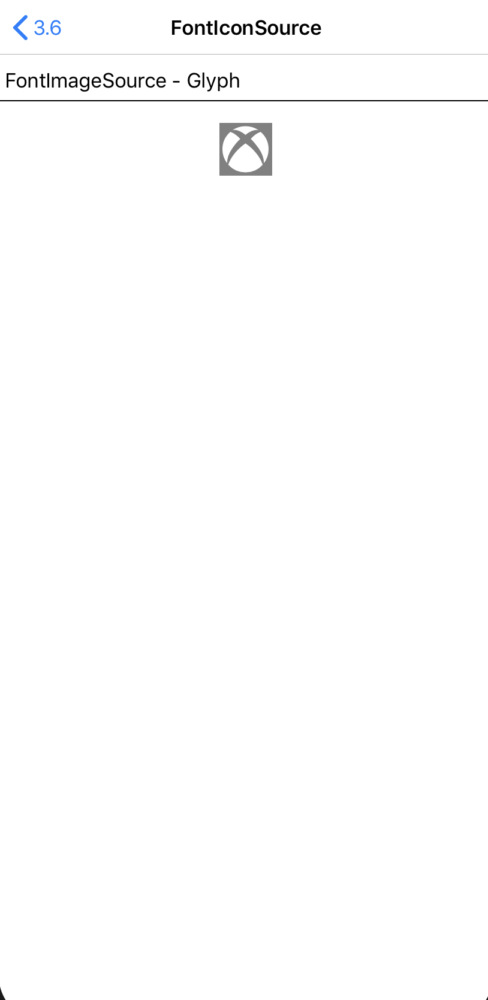
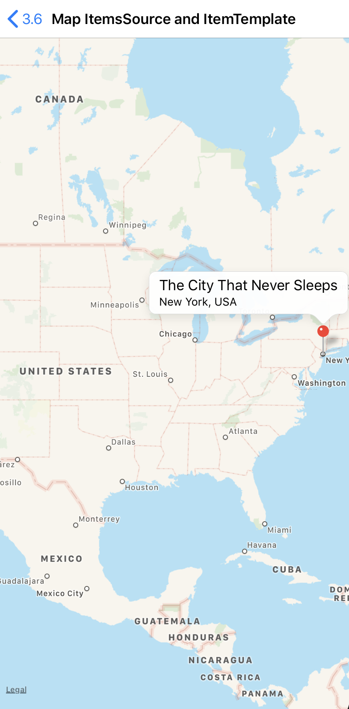
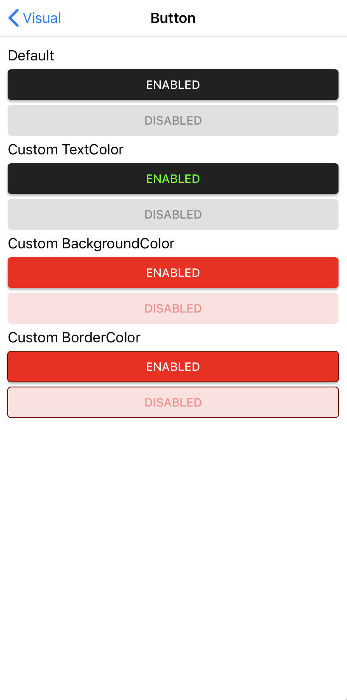
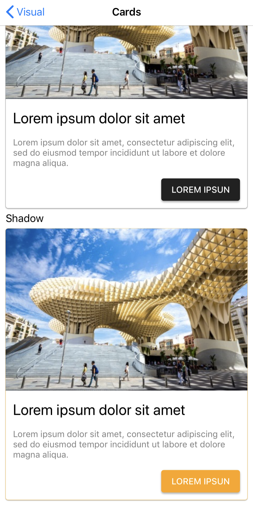
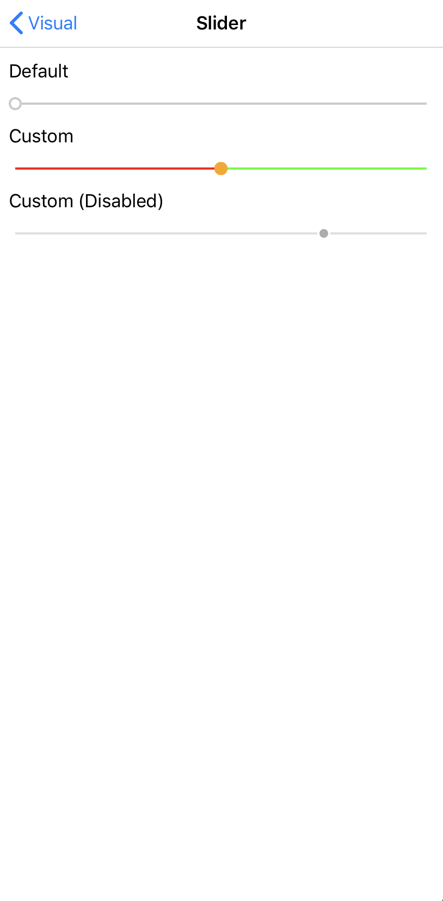

# ThreeSixPlayground

**Xamarin.Forms** sample to show the main features of **3.6** version.

The sample is available for three platforms:

- iOS
- Android

Features:
- Entry - Read-only
- FontImageSource
- Map ItemsSource and ItemTemplate
- Visual 

## Screenshots

    

## Copyright and license

Code released under the [MIT license](https://opensource.org/licenses/MIT).